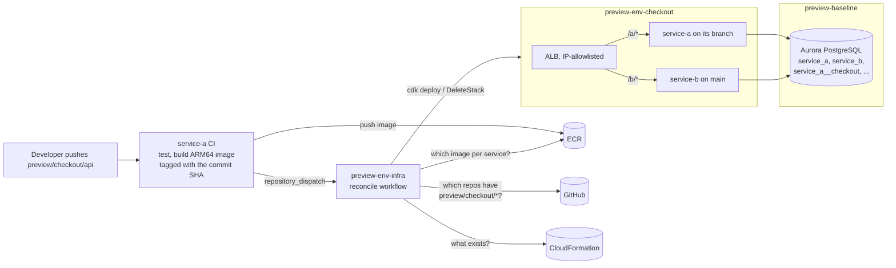

# preview-env-infra

**The problem:** a team runs several microservices against a shared database, with a single shared dev environment. When a feature spans more than one service, its branches can only be tested together in that one environment, so feature groups queue up behind each other, step on each other's changes, and slow deployment down.

**What this does:** it gives every feature group its own short-lived, fully working copy of the system, created automatically when a branch is pushed and removed when the work is merged. Teams test in parallel instead of taking turns.

The original take-home prompt is in [`prompt.md`](prompt.md).

Per-branch **preview environments** on AWS for a team of containerized microservices, built with **AWS CDK (Python)**, ECS Fargate, Aurora Serverless v2 PostgreSQL and GitHub Actions.

Push a `preview/<group>/...` branch to any service repo and you get an isolated, end-to-end copy of the system: every service, each with its own logical database (copied from `main`), behind one load balancer per preview environment. Services with a branch in that group run their branch; the rest run `main`. When a branch is merged or deleted, its service falls back to `main`; once no branches remain in the group, the environment tears itself down.

This repo is the platform: the shared infrastructure, the environment definition, and the **reconciler** that decides what each environment runs. The two demo services live in their own repos: [service-a](https://github.com/matthewcummings/service-a) and [service-b](https://github.com/matthewcummings/service-b). (Inside a company I'd probably call this repo `dev-infra`: it also holds the shared dev baseline.)

> **Why three repos?** The prompt asks for two service repos plus a CDK project. Shared infrastructure doesn't belong in either service's codebase, so it lives here, and this README is the entry point.

## Branch and service matrix (a simple two-service example)

A and B are service-a and service-b. The same rules apply to any number of services.

| Prompt scenario | What you push | What you get |
|---|---|---|
| New branch in A only | A: `preview/checkout/api` | env `checkout`: A's branch + B's `main` |
| New branch in B only | B: `preview/search/index` | env `search`: A's `main` + B's branch |
| A and B, same feature group | A: `preview/checkout/api`, B: `preview/checkout/schema` | one env `checkout` running both branches |
| A and B, different groups | A: `preview/checkout/api`, B: `preview/search/index` | two envs, each paired with the other service's `main` |
| Branch deleted or merged | delete `preview/checkout/api` | env `checkout` falls back to A's `main` if B's branch remains, or is torn down when no branches remain |

**Feature groups are a branch naming convention:** `preview/<group>[/<description>]`.
- The same `<group>` in several repos means the same environment. A solo feature is just a group of one, so one rule covers all four scenarios.
- The `/<description>` part is optional and never matters for grouping: `preview/checkout/api` in A and `preview/checkout/schema` in B share env `checkout`, and so would `preview/checkout` alone.
- One branch per repo per group: if a repo has two branches in the same group (say `preview/checkout/a` and `preview/checkout/b`), the reconciler refuses, names both branches, and leaves the environment unchanged.
- Group names are strict: 1-20 characters of `a-z`, `0-9` and `-`, and not `main`. Lowercase only, so there's no ambiguity between look-alikes such as `Checkout` and `checkout`. The length limit keeps names within AWS resource-name limits. Invalid names are rejected with a clear message, never silently converted, so the group is always exactly what you typed.
- Branches without the `preview/` prefix get no environment, loudly: CI explains why and how to rename the branch.

**Where to look next:**
- [`docs/decisions.md`](docs/decisions.md): every design decision (D1-D42), what I considered and why. Code comments cite these IDs.
- [How it works](#how-it-works) below, then the code: [`reconciler/core.py`](reconciler/core.py) is the heart of it.

**CI:** every push runs the tests, lint and `cdk synth` in GitHub Actions ([infra](https://github.com/matthewcummings/preview-env-infra/actions), [service-a](https://github.com/matthewcummings/service-a/actions), [service-b](https://github.com/matthewcummings/service-b/actions)), and every deploy smoke-tests the live environment.

<!-- TODO(matt): video link, live URL note, links to specific preview deploy runs -->

## Service boundaries and data ownership

The prompt describes microservices "with a shared database". I read that as **one shared database server with strict per-service boundaries**, not shared tables:

- One Aurora cluster. Each service owns its own **logical database** (`service_a`, `service_b`) and DB user. `CONNECT` is revoked from everyone else, and IAM only lets a service's tasks log in as that service's user.
- In each preview environment, each service gets **its own logical database on the same cluster** (e.g. `service_a__checkout`). It's copied from `main` when the environment is created, and kept across later pushes. A preview copies `main` through a **read-only** user, so it can't write to `main`.
- Each preview's database user has a connection limit and a statement timeout, so one busy preview can't starve `main` or the other previews.
- Services never read each other's tables; anything cross-service would go through the owning service's API.

Details and alternatives (schemas, a cluster per service, Aurora clones, sidecar databases): D12, D40, D41 in [`docs/decisions.md`](docs/decisions.md).

## How it works

There are two kinds of CloudFormation stack:
- **`preview-baseline`**: the long-lived baseline, deployed once: VPC, ECS cluster, ECR repositories, the Aurora cluster, and the GitHub OIDC roles.
- **`preview-env-<name>`**: one per environment, including `main` (`preview-env-main`) and each preview (`preview-env-checkout`): a load balancer plus one service per registered app.



1. **Service CI** (in each service repo): lint, tests, a migration check (fails if two merged branches each added a database migration, leaving two parallel migration histories), and a Docker build. On `main` or `preview/*`, it pushes an ARM64 image tagged with the full commit SHA and sends this repo an event (`repository_dispatch`). Deleting a `preview/*` branch also sends an event.
2. **The reconciler** (this repo, [`reconciler/`](reconciler/)) works out the environment from scratch on every run:
   - **Desired state** comes from GitHub: which registered repos have a branch in this group.
   - **Images** come from ECR, by commit SHA. A branch whose image isn't built yet runs `main` for now, and the plan says so.
   - **Actual state** comes from CloudFormation: does `preview-env-<group>` exist?
   - Then it creates, updates, or deletes the stack. It keeps no state of its own, so any event just means "go look again".
3. **CDK** ([`infra/`](infra/)) builds each environment from one construct, used for `main` and every preview. The only difference is each service's database: in `main`, a service migrates and seeds its own database; in a preview, it copies `main`'s database once (when the environment is created), then applies the branch's migrations on top.
4. **Each deploy runs a smoke test:** health, the expected commit SHA per service, a CRUD round trip, and (for previews) a check that data doesn't leak into `main`.

**Races:** each group maps to exactly one stack, and deploys for the same environment queue up (GitHub Actions `concurrency`). GitHub keeps only the newest waiting run per queue and drops older ones. That's safe here because every run recomputes the whole plan from GitHub and CloudFormation, so the newest run always covers everything (D24).

## Deployment guide

### 1. Get the code

Fork all three repos ([preview-env-infra](https://github.com/matthewcummings/preview-env-infra), [service-a](https://github.com/matthewcummings/service-a), [service-b](https://github.com/matthewcummings/service-b)) into the **same** GitHub account or organization: the tooling looks up all the service repos under a single owner. Then clone them side by side:

```bash
mkdir preview-envs && cd preview-envs
for repo in preview-env-infra service-a service-b; do git clone https://github.com/<your-github-owner>/$repo.git; done
cd preview-env-infra
```

Every command from here on runs in `preview-env-infra`.

### 2. Install the tools

Supported: macOS, Linux, or Windows via WSL2.

**The quick way:** install [mise](https://mise.jdx.dev/), then run `mise install` in `preview-env-infra`. It installs the pinned uv, Node.js, AWS CLI and GitHub CLI from `mise.toml`. uv then installs Python 3.14 and every Python dependency by itself the first time you run anything.

**Or install these yourself:**

| Tool | Version | Why |
|---|---|---|
| [uv](https://docs.astral.sh/uv/) | 0.12+ | Python 3.14 and all Python dependencies |
| Node.js | 24 | Runs the pinned CDK CLI (`npx cdk`) |
| AWS CLI | v2 | Credentials and region |
| [GitHub CLI](https://cli.github.com/) (`gh`) | 2+, logged in (`gh auth login`) | Configures your repos in step 7 and checks them in step 4 |

**Either way, you also need `make`** (macOS: Xcode Command Line Tools; Ubuntu/WSL: `sudo apt install make`). Docker is only needed to run the service repos' tests, not to deploy: CI builds the images.

### 3. Set up AWS access, your GitHub owner and a GitHub token

- **AWS:** your terminal needs credentials for an IAM identity with admin rights. Only this first-time setup uses them; CI never does. Choose your region **once** in your AWS config (`AWS_REGION` or your profile's `region`; `us-east-1` if unset), and everything else follows it.
- **GitHub owner:** in your fork of `preview-env-infra`, set `github_owner` in [`services.yaml`](services.yaml) to the owner of your forks: your GitHub organization, or for personal forks, your GitHub username. (Alternatively, set the `PREVIEW_ENV_GITHUB_OWNER` environment variable.)
- **GitHub token:** the service repos' CI needs a token that lets it signal this repo. Create a fine-grained token at [github.com/settings/personal-access-tokens/new](https://github.com/settings/personal-access-tokens/new):
  - **Resource owner:** your GitHub owner. **Expiration:** 30 days.
  - **Repository access:** "Only select repositories", then only **`preview-env-infra`**.
  - **Repository permissions:** **Contents: Read and write** (Metadata: read-only is added automatically).

  Then `export INFRA_DISPATCH_TOKEN=<the token>` in your terminal. Step 4 checks it, and step 7 stores it in the service repos.

### 4. Check your setup

```bash
make doctor
```

A read-only checklist: tools, AWS credentials and region, CDK bootstrap, your GitHub repos and their settings, and whether your token can signal this repo. On a fresh setup, expect warnings for the things later steps do (no CDK bootstrap yet, GitHub not configured yet). Anything marked FAIL needs fixing first. Rerun it any time.

### 5. Bootstrap CDK (once per account and region)

```bash
make bootstrap
```

Creates the standard resources CDK needs to deploy (an S3 bucket, an ECR repo, IAM roles). Harmless to rerun.

### 6. Deploy the baseline (~15-20 minutes)

```bash
make deploy-baseline ALLOW_MY_IP=1
```

Creates the `preview-baseline` stack: the VPC and NAT gateway, the ECS cluster, one ECR repository per service, the Aurora cluster, and the GitHub OIDC roles CI uses. Most of the time is Aurora. It reuses your account's GitHub OIDC provider if you already have one. `ALLOW_MY_IP=1` then adds your public IP to the load balancer allowlist, so you can reach the environments.

### 7. Connect GitHub

```bash
make setup-github
```

This sets the GitHub Actions variables on all three repos from `preview-baseline`'s outputs, stores the token as a secret in the two service repos, and turns on **"Automatically delete head branches"** so that merging a PR deletes its branch and tears its preview down. `make setup-github DRY_RUN=1` shows the `gh` commands without running them. Rerun `make doctor` afterwards: the GitHub checks should all pass.

### 8. Build the first images and deploy `main`

Service images are built by CI, so trigger it once in each service repo:

```bash
cd ../service-a && git commit --allow-empty -m "Build the first image" && git push
cd ../service-b && git commit --allow-empty -m "Build the first image" && git push
cd ../preview-env-infra
```

Each push builds and publishes an image, then signals this repo, which deploys the `main` environment (`preview-env-main`). Watch it in this repo's **Actions** tab. The first run may report "waiting for images" until both services have built; the run after the second build deploys and ends with a smoke test. (`make deploy-main` does the same deploy from your laptop.)

### 9. Create your first preview

```bash
cd ../service-a && git switch -c preview/demo/hello && git push -u origin HEAD
```

This creates the `demo` preview environment: service-a on your branch, service-b on `main`. The reconcile run in this repo's **Actions** tab prints the plan, deploys `preview-env-demo`, smoke-tests it, and shows its URL. Push a `preview/demo/...` branch in service-b too, and the same environment picks it up. Delete the branches, and the environment goes away.

<!-- TODO(matt): verify every step end to end and add real timings -->

### Using it

```bash
URL=$(aws cloudformation describe-stacks --stack-name preview-env-demo \
      --query "Stacks[0].Outputs[?contains(OutputKey,'Url')].OutputValue" --output text)
curl $URL/a/version          # {"service": "service-a", "env": "demo", "branch": "preview/demo/hello", ...}
curl $URL/b/version          # service-b on main
curl -X POST $URL/a/items -H 'content-type: application/json' -d '{"name": "hello"}'
```

| Command | What it does |
|---|---|
| `make plan BRANCH=... \| GROUP=...` | Show what the reconciler would do, without changing anything. Add `NO_AWS=1` to see the branch-to-service decisions with no AWS account at all (it only reads GitHub). |
| `make preview BRANCH=...` | Reconcile one environment by hand (the same thing CI does). |
| `make smoke ENV=<env>` | Run the smoke test against an environment. |
| `make allow-ip` / `disallow-ip` / `list-ips` | Manage the load balancer allowlist (your IP by default, or `CIDR=...`). |
| `make teardown GROUP=<group>` | Operator tool: delete a preview now, even if its branches still exist (for a missed delete event). |

All targets: `make help`. What each GitHub Actions workflow does: [`docs/operations.md`](docs/operations.md).

### Tearing everything down

<!-- TODO(matt): consider a `make destroy-all` target -->

1. Delete every `preview/*` branch (or `make teardown GROUP=...` for each), then delete the `preview-env-main` stack.
2. Delete the `preview-baseline` stack. Aurora takes a **final snapshot** on deletion; delete it from the RDS console to stop its (small) storage cost.
3. Optionally delete the `CDKToolkit` stack and its S3 bucket.

## What it costs

Idle, the fixed costs are the NAT gateway (~$0.045/hour), Aurora's minimum 0.5 ACU (~$0.06/hour), and one ALB per environment (~$0.0225/hour each), plus small Fargate tasks (512 CPU / 1 GB, ARM64) per service per environment. Roughly **$4-5/day** for the shared baseline and `main`, plus about **$1.50/day** per idle preview (its ALB and two small tasks), plus public IPv4 charges for the NAT gateway and ALBs. <!-- TODO(matt): check against real billing -->

## Security notes

- **No long-lived AWS credentials anywhere.** GitHub Actions uses OIDC. Service repos can only push images to their own ECR repository. Only this repo's `main` branch can deploy, and only through CDK's bootstrap roles (D11, D32).
- **The APIs have no authentication, so every load balancer is IP-allowlisted** through a shared managed prefix list. Nothing is open to the internet unless you add it. CI adds its runner's IP only for the smoke test and always removes it (D42).
- **HTTP only, no TLS.** A certificate needs a domain; with one, I'd add HTTPS and authentication at the load balancer.
- The database is IAM-auth only: no DB passwords in the apps (D16).

## What's built, and what's next

**Built:** the four prompt scenarios, teardown, per-environment databases copied from `main`, the queueing and races, IP allowlisting, smoke tests, and the setup tooling.

**Documented, not built** (D29 in [`docs/decisions.md`](docs/decisions.md)):
- A nightly sweep and age limit for forgotten environments.
- Reconciling every environment when `main` moves (today, previews pick up new `main` images on their next push).
- A cap on concurrent previews.
- Stale-branch warnings, and PR comments with the environment URL.
- `cdk diff` on infra PRs.
- Alerting on the shared cluster.
- A "reset preview data" workflow.

**Scaling past a handful of services:** every preview runs every service, so databases and connections grow with environments x services. The fix, in order: smaller pools (done), **partial environments** (deploy only the services that changed and route the rest to `main`), RDS Proxy, then a cluster per service (D41).

**Production** is out of scope: a separate account, promoting the exact image digest already tested on `main` with a release tag and an approval, and never copying production data into previews (D18).

**Considered, not adopted:** EKS (a namespace per preview with Argo CD is the pattern at larger scale; D5 maps each piece), a monorepo, and [`cdk-pipelines-github`](https://github.com/cdklabs/cdk-pipelines-github) (pipelines defined in CDK).

## Repository layout

| Path | What's there |
|---|---|
| `reconciler/` | The reconciler: pure core (`core.py`, `branches.py`), adapters for GitHub/ECR/CloudFormation/CDK, CLI. |
| `infra/` | CDK: `preview-baseline` (`shared_stack.py`), the environment construct (`environment.py`), the database component (`database.py`), preview databases via the RDS Data API (`preview_db.py`, `data_api.py`), GitHub OIDC (`github_oidc.py`). |
| `scripts/` | Setup and operations: `deploy_baseline.py`, `setup_github.py`, `smoke_test.py`, `allow_ip.py`, `doctor.py`. |
| `services.yaml` | The service registry: adding a service is one entry here (D25). |
| `.github/workflows/` | `ci.yml` (PR checks), `platform.yml` (deploy on `main`), `reconcile.yml` (previews). |
| `tests/` | Reconciler, CDK assertion and script tests. |

## Development

From this repo's root (needs uv, Node.js and `make`; Docker only for the service repos' tests):

```bash
make test     # all tests: reconciler, CDK template assertions, scripts (no AWS, no network)
make lint     # ruff lint + format check
make synth    # generate the CloudFormation templates; no AWS credentials needed
```

In each service repo, `uv run pytest` runs the app's tests against a throwaway Postgres 17 (testcontainers).

## Glossary

- **Preview environment:** a temporary, isolated copy of the system for one feature group. Also known as *review apps* (GitLab, Heroku) or *preview deployments* (Vercel, Render).
- **Feature group:** the `<group>` in `preview/<group>/...`. Branches in different repos with the same group share one environment.
- **`main` environment:** the shared dev environment, running every service's `main`.

## How this was built

<!-- TODO(matt): write this section in my own words (tools list + AI use). Draft material: notes 05-tools.md -->
